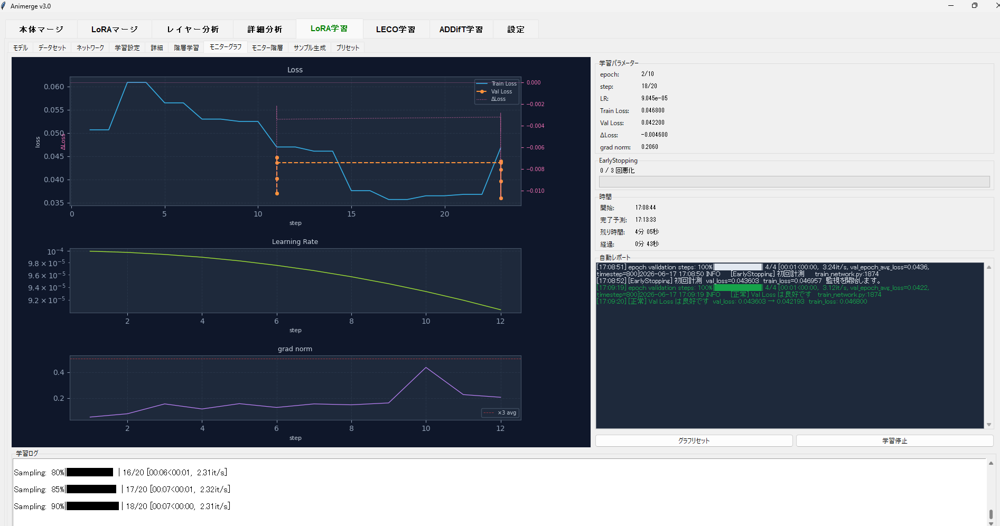

# Animerge

Animerge は Anima モデルのチェックポイントと LoRA ファイルを扱うためのデスクトップ GUI ツールです。現時点の実装はマージ、解析、LoRA 学習機能です。全ての機能で階層指定に対応しています。

  

## モデル / モデル配布

- [HuggingFace - circlestone-labs/Anima](https://huggingface.co/circlestone-labs/Anima)

ベースモデルは `checkpoints/`、LoRA は `lora/` に配置します。対応拡張子は `.safetensors`, `.ckpt`, `.bin` です。

## 現在の主な機能

- **モデル同士のマージ**
  - 2つのベースモデル（Model A, Model B）のブレンド。
- **LoRA のモデルへのフューズ**
  - 指定した LoRA テンソルをベースモデルに結合。
- **LoRA 同士のマージ**
  - 2つの LoRA ファイル（LoRA A, LoRA B）のブレンド。
- **モデル差分からの LoRA 抽出**
  - 2つのモデル（マージ元、マージ後など）の差分から LoRA 構造の作成。
- **CLIP/Text Encoder/VAE の除外**
  - マージ対象（`clip`, `text_encoder`, `conditioner`, `vae`, `first_stage_model`）のフィルタリング。
- **Alpha スケーリングと領域別・コンポーネント別調整**
  - Matrix: ブロック（Input, Middle, Output） x コンポーネント（Attention, MLP, Norm, ResNet, Timestep）。
  - Transformer: ベースモデルから読み込んだ transformer/block 単位。
  - Component: 主要コンポーネント単位（MLP, Norm, ResNet, Timestep, Other）。
- **スライダーと数値入力による調整**
- **Cosine similarity による自動補正**
- **Input/Middle/Output bias の freeze**
- **Dry-run による tensor finite-value 検証**
- **LoRA キー名の正規化**
- **レイヤー分析と詳細分析ビューア**
  - Canvasベースのグラフおよびヒートマップ表示による分析プレビュー（Feature_Map, Statistical, SVD_Rank, Attention_Map 対応）。
  - 同一手法ログ2本を読み込んだ相性スコア・差分チャート表示によるレポート比較。
- **`kohya-ss/sd-scripts` を組み込んだ Anima 向け LoRA 学習 GUI**
  - 選択可能な Optimizer（`AdamW`, `AdamW8bit`, `Adafactor`, `DAdaptAdam`, `DAdaptAdaGrad`, `DAdaptSGD`, `Lion`, `Prodigy`）。
  - 選択可能な LR Scheduler（`constant`, `constant_with_warmup`, `cosine`, `cosine_with_restarts`, `linear`, `polynomial`）。
  - 選択可能な精度、タイムステップサンプリング、Attention モード、重み付けスキームの設定。
  - Train Loss, Val Loss, LR, grad_norm, ΔLoss のリアルタイムモニタリンググラフ機能。
  - EarlyStopping カウンタ進捗、推定残り時間、自動診断メッセージの表示。

## 主な参照ファイル

- `app/gui.py`: Tkinter GUI 本体とタブ構成（本体マージ / LoRAマージ / レイヤー分析 / 詳細分析 / LoRA学習）。
- `app/merge.py`: モデル/LoRA のマージ処理（除外マーカー設定、カテゴリ分類、各種マージ・抽出ロジック）。
- `app/model_io.py`: モデル走査、読み込み、保存、拡張子検証（`.safetensors`, `.ckpt`, `.bin`）、ハッシュ計算。
- `app/analysis.py`: レイヤー分析処理。
- `app/analysis_viewer.py`: 詳細分析ビューア。
- `app/monitor_graph.py`: LoRA学習リアルタイムモニタリングウィジェット（グラフ表示、パラメータパネル、自動レポートパネル）。
- `app/lora_train.py`: LoRA 学習タブと `sd-scripts` 実行コマンド生成、パラメータ定数管理。
- `sd-scripts/`: `kohya-ss/sd-scripts` をベースにした Anima LoRA 学習用スクリプト群。

## 動作確認環境

- Python 3.12
- PyTorch 2.8
- CUDA 12.8 (`cu128`)
- Windows

## 使用オープンソース
- circlestone-labs/Anima モデル開発に多大な感謝
- kohya-ss/sd-scripts 氏とメンテナーの一同へ多大な感謝

## License

Animerge is licensed under Apache-2.0.

This repository includes scripts based on `kohya-ss/sd-scripts`. The majority of those scripts are licensed under ASL 2.0, including code from Diffusers, cloneofsimo's work, and LoCon. Portions of the project are available under separate license terms:

- Memory Efficient Attention Pytorch: MIT
- bitsandbytes: MIT
- BLIP: BSD-3-Clause